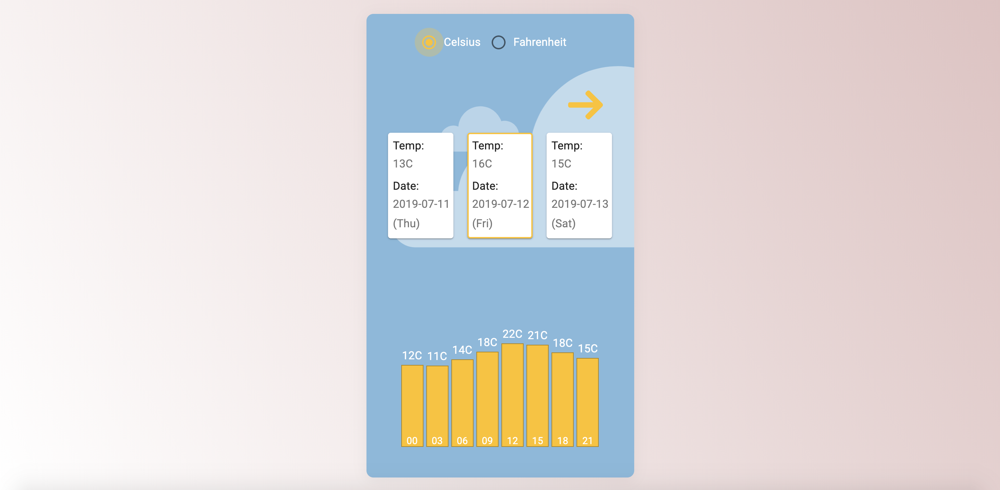

## The Weather App

An application used to show the weather in Munich in the next 5 days with React, Redux, Redux-thunk, Material-ui, JavaScript and CSS.
This project was bootstrapped with [Create React App](https://github.com/facebook/create-react-app).

### Project Screen Shot and Live Demo

Live demo : [http://janedzumerko.com/weather](http://janedzumerko.com/weather)

### Reflection

I think the biggest challenge for me in this task was the part that I didn't only want to build application for weather that simply shows the data. I wanted the whole experience during application usage to be smooth.

The weather data I am receiving from OpenWeatherMap was array of data for 5 days, each day containing a maximum of 8 weather segments (3 hours). For better optimization when user selects different cards to see data for selected day I decided to use Object (similar to Map in JavaScript) because it takes constant time O(1) for access.

The temperature received from the API is in Kelvin. On loading the data I am calculating that to fahrenheit and celsius and storing it in redux with other informations, so there won't be need of converting all the time when user switch from celsius to fahrenheit or vice versa.

### Installation and Setup Instructions

Clone down this repository. You will need `node` and `npm` installed globally on your machine.
In the project directory, you can run:

##### `npm start`

Runs the app in the development mode.
Open [http://localhost:3000](http://localhost:3000) to view it in the browser.

##### `npm test`

Launches the test runner in the interactive watch mode.

##### `npm run build`

Builds the app for production to the `build` folder.